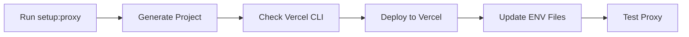

# Proxy Deployment Guide

## Overview

The 1inch API requires a proxy server to handle CORS (Cross-Origin Resource Sharing) issues when making requests 
from browser-based applications. This guide explains our automated deployment system that deploys the **exact official 1inch Vercel proxy** to Vercel with zero configuration.

### Official Repository Source

Our implementation uses the exact code from the official 1inch Vercel proxy repository:
- **Source**: `https://github.com/Tanz0rz/1inch-vercel-proxy`
- **Files**: Exact `api/proxy.js` and `vercel.json` from the official repo
- **Environment Variables**: Uses official variable names (`API_AUTH_TOKEN`, `ALLOWED_ORIGIN`)
- **Behavior**: Identical CORS handling, authentication, and error responses

## Quick Start

### Option 1: Full Bootstrap (Recommended)

```bash
yarn bootstrap
```

The bootstrap command includes proxy deployment automatically and will:
- Check system dependencies
- Initialize NEAR submodule  
- Install all dependencies
- Set up Rust for NEAR
- **Deploy the 1inch proxy** (included in bootstrap)
- Create environment files
- Start all services

### Option 2: Standalone Proxy Deployment

```bash
yarn setup:proxy
```

This standalone command will:
- Check/install Vercel CLI
- Generate the exact official 1inch proxy project
- Deploy to Vercel automatically
- Update your environment files with the deployed URL
- Guide you through the required manual configuration steps

**Note**: Due to Vercel's security settings, you'll need to complete two manual steps in the Vercel dashboard after deployment:
1. Disable Vercel Authentication (Settings → Deployment Protection)
2. Verify the API_AUTH_TOKEN environment variable is set

### Prerequisites

**For Deployment Only**:
1. **Vercel Account**: Free account at https://vercel.com (you'll be prompted to login)
2. **Internet Connection**: Required for Vercel CLI installation and deployment

**For Proxy to Function** (can be added after deployment):
1. **1inch API Key**: Either provide during setup or add later via Vercel dashboard
   - Without API key: Proxy deploys but returns error when called
   - With API key: Proxy works immediately

**Note**: The proxy can be deployed without a 1inch API key. You can add the key later through Vercel's dashboard under Environment Variables.

## How It Works

### 1. Exact Official Code Generation

The proxy setup bundles the exact code from the official 1inch repository:
- **API Handler**: `api/proxy.js` - Exact copy from `Tanz0rz/1inch-vercel-proxy`
- **Vercel Config**: Identical `vercel.json` configuration from official repo
- **Environment Variables**: Uses official names (`API_AUTH_TOKEN`, `ALLOWED_ORIGIN`)
- **CORS Logic**: Exact localhost detection and origin validation from official implementation

### 2. Deployment Process



### 3. What Gets Deployed

```
1balancer-proxy/
├── api/
│   └── proxy.js        # Exact official proxy handler
├── vercel.json         # Exact official Vercel configuration
├── package.json        # Project metadata
└── README.md          # Deployment documentation
```

**Note**: This structure is identical to manually cloning and deploying the official `Tanz0rz/1inch-vercel-proxy` repository.

## Manual Deployment

If you prefer to deploy manually or need custom configuration:

### Step 1: Generate Proxy Files

```bash
node scripts/generate-proxy.js ./my-proxy
```

### Step 2: Add Your API Key

```bash
cd my-proxy
echo "ONEINCH_API_KEY=your_key_here" > .env
```

### Step 3: Deploy to Vercel

```bash
vercel --prod
```

### Step 4: Update Environment

Add to `packages/nextjs/.env.local`:
```env
NEXT_PUBLIC_PROXY_URL=https://your-deployment.vercel.app
NEXT_PUBLIC_ONE_INCH_API_URL=https://your-deployment.vercel.app
```

## Required Configuration

### Keys and Accounts Needed

There are two different requirements involved in the proxy setup:

1. **Vercel Account (Required for Deployment)**
   - Free account at https://vercel.com/
   - Used to deploy the proxy server
   - No API key needed - just login via CLI
   - The deployment process is completely free

2. **1inch API Key (Optional During Deployment, Required for Function)**
   - Get from https://portal.1inch.dev/ or ETHGlobal hackathon
   - Used by the deployed proxy to authenticate with 1inch API
   - Can be:
     - Provided during setup for immediate functionality
     - Added later via Vercel dashboard (Settings → Environment Variables)
     - Skipped entirely during deployment (proxy will deploy but return errors when called)

### 1. 1inch API Key Setup

The proxy needs a 1inch API key to function properly. Here's how to get one:

#### For Hackathons (Recommended - No KYC Required)
1. **ETHGlobal Process**: If you're participating in an ETHGlobal hackathon:
   - Contact ETHGlobal organizers for 1inch API key access
   - They provide special keys without KYC requirements
   - This is the fastest method for hackathon participants

#### For General Development
1. **Visit 1inch Dev Portal**: Go to https://portal.1inch.dev/
2. **Create Account**: Sign up with your email
3. **Complete KYC**: Standard KYC process may be required
4. **Generate API Key**: Create a new API key for your project

### 2. Environment Variable Setup

#### What to Set in Your .env File

After getting your API key, add it to your **root .env file**:

```env
# 1inch API Configuration
ONEINCH_API_KEY=your_actual_api_key_here

# Example:
# ONEINCH_API_KEY=abc123def456ghi789jkl012mno345pqr678stu901vwx234yz

# Other required variables for the project
NEXT_PUBLIC_PRIVY_APP_ID=your_privy_app_id_here
ALCHEMY_API_KEY=your_alchemy_key_here
```

#### Important Notes

- **Variable Name**: Use `ONEINCH_API_KEY` in your .env file (our scripts handle the conversion to `API_AUTH_TOKEN` for the proxy)
- **Location**: Set this in the **root .env file**, not in package-specific env files
- **Security**: Never commit this key to git - it's already in .gitignore
- **Format**: The key is a long alphanumeric string (no quotes needed in .env)

### 3. Proxy Environment Variables

The deployed Vercel proxy uses these environment variables (handled automatically):

- **`API_AUTH_TOKEN`**: Your 1inch API key (automatically set during deployment)
- **`ALLOWED_ORIGIN`**: CORS origin (optional, defaults to localhost for development)

### 4. Vercel Configuration

The proxy is deployed with these settings:
- **Runtime**: Node.js 18+
- **Regions**: Auto-selected by Vercel for optimal performance  
- **Memory**: 1024 MB (default)
- **Timeout**: No custom timeout (uses Vercel defaults)

## API Endpoints

All 1inch API endpoints are available through the proxy. Replace `https://api.1inch.dev` with your proxy URL:

### Example
- **1inch API**: `https://api.1inch.dev/swap/v6.0/1/quote`
- **Your Proxy**: `https://your-proxy.vercel.app/swap/v6.0/1/quote`

### Available Endpoints

#### Swap API
- `/swap/v6.0/{chain}/quote`
- `/swap/v6.0/{chain}/swap`

#### Price API
- `/price/v1.1/{chain}`
- `/price/v1.1/{chain}/{token}`

#### Token API
- `/tokens/v1.1/{chain}`

#### Balance API
- `/balance/v1.2/{chain}/balances/{wallet}`

#### Orderbook API
- `/orderbook/v4.0/{chain}`

## Testing

Test your proxy deployment:

```bash
yarn test:proxy
# or
node scripts/test-proxy.js https://your-proxy.vercel.app
```

The test script will verify:
- ✅ API connectivity
- ✅ CORS headers
- ✅ Response times
- ✅ Error handling

## Troubleshooting

### Initial Setup - 401 Errors After Deployment

**If you see 401 errors immediately after running `yarn setup:proxy`**, this is expected! You need to:

1. **Disable Vercel Authentication**
   - Go to [Vercel Dashboard](https://vercel.com/dashboard)
   - Select your "1inch-proxy" project
   - Go to Settings → Deployment Protection
   - Turn OFF "Vercel Authentication"
   - This is required for public access to your proxy

2. **Verify Environment Variable**
   - While in Settings, go to Environment Variables
   - Confirm `API_AUTH_TOKEN` is listed with a value
   - If missing, add it with your 1inch API key

3. **Test Again**
   - No redeploy needed - changes take effect immediately
   - Run `yarn proxy:test` or test manually

### API Key Issues

1. **"API_AUTH_TOKEN is missing from env" Error**
   - **Cause**: 1inch API key not set in your root `.env` file
   - **Solution**: Add `ONEINCH_API_KEY=your_key_here` to your root `.env` file
   - **Where to get key**: See "1inch API Key Setup" section above

2. **"Authentication failed" or 401 Errors (after disabling Vercel Auth)**
   - **Cause**: Invalid or expired 1inch API key
   - **Solution**: Verify your key works by testing at https://portal.1inch.dev/
   - **For hackathons**: Contact ETHGlobal organizers for a fresh key

3. **Key Format Issues**
   - **Correct format**: Long alphanumeric string (usually 64+ characters)
   - **Incorrect**: Short keys, keys with special characters, or demo keys
   - **Example**: `abc123def456ghi789jkl012mno345pqr678stu901vwx234yz567`

### Deployment Fails

1. **Vercel CLI Not Found**
   ```bash
   npm install -g vercel
   ```

2. **Not Logged In to Vercel**
   ```bash
   vercel login
   ```

3. **Vercel Deployment Errors**
   - Ensure you have a free Vercel account
   - Check your internet connection
   - Try manual deployment (see manual deployment section)

### CORS Errors Still Occurring

1. **Wrong Proxy URL**
   - Verify `NEXT_PUBLIC_PROXY_URL` in `.env.local`
   - Ensure no trailing slashes

2. **API Key Not Set**
   - Check Vercel dashboard → Settings → Environment Variables
   - Redeploy after adding the key

3. **Cache Issues**
   - Clear browser cache
   - Restart development server

### Slow Response Times

1. **Cold Starts**
   - First request may be slower
   - Subsequent requests will be faster

2. **Region Selection**
   - Vercel auto-selects optimal regions
   - Consider Enterprise plan for dedicated resources

## Post-Deployment Configuration

### Important: Disable Vercel Authentication

After deployment, you must disable Vercel Authentication for the proxy to be publicly accessible:

1. Go to your [Vercel Dashboard](https://vercel.com/dashboard)
2. Select your proxy project
3. Go to **Settings** → **Deployment Protection**
4. **Disable "Vercel Authentication"**
5. Save changes

Without this step, all proxy requests will redirect to Vercel's authentication page.

### Add Environment Variables (if not done during setup)

1. In Vercel Dashboard, go to **Settings** → **Environment Variables**
2. Add: `API_AUTH_TOKEN` = `your_1inch_api_key_here`
3. Redeploy for changes to take effect

## Security Considerations

### API Key Protection

- ✅ API key stored server-side only
- ✅ Never exposed to browser
- ✅ Secure environment variables

### Access Control

For production:
- The official proxy supports `ALLOWED_ORIGIN` environment variable
- Set it in Vercel to restrict access to your domain only
- Leave blank for localhost development

### Rate Limiting

Consider implementing rate limiting for production:
- Use Vercel Edge Config
- Monitor usage in Vercel dashboard

## Advanced Configuration

### Custom Domain

1. Add domain in Vercel dashboard
2. Update DNS records
3. Update environment variables

### Multiple Environments

```bash
# Development
vercel --env ONEINCH_API_KEY=$DEV_KEY

# Production
vercel --prod --env ONEINCH_API_KEY=$PROD_KEY
```

### Monitoring

- View logs: `vercel logs`
- Check analytics in Vercel dashboard
- Set up alerts for errors

## Cost Considerations

Vercel Free Tier includes:
- 100GB bandwidth
- 100GB-hours compute
- Unlimited deployments

This is typically sufficient for:
- Development
- Testing
- Small production apps

## Alternative Deployment Options

If Vercel doesn't meet your needs:

1. **Cloudflare Workers**
   - Similar edge deployment
   - Different pricing model

2. **AWS Lambda**
   - More control
   - Requires more setup

3. **Self-Hosted**
   - Use included nginx/express examples
   - Full control over infrastructure

## Integration with Frontend

Once deployed, use the proxy in your code:

```typescript
// services/oneInchClient.ts
const API_BASE = process.env.NEXT_PUBLIC_PROXY_URL;

const response = await fetch(`${API_BASE}/swap/v6.0/1/quote`, {
  method: 'GET',
  headers: {
    'Content-Type': 'application/json'
  }
});
```

## Updating the Proxy

To update proxy code:

1. Modify `scripts/generate-proxy.js`
2. Run `yarn setup:proxy` again
3. Choose to redeploy

Or manually:
```bash
cd .proxy-temp
vercel --prod
```

## Support

- **Issues**: Check [GitHub Issues](https://github.com/1balancer/1balancer)
- **1inch API**: [Documentation](https://docs.1inch.io/)
- **Vercel**: [Documentation](https://vercel.com/docs)