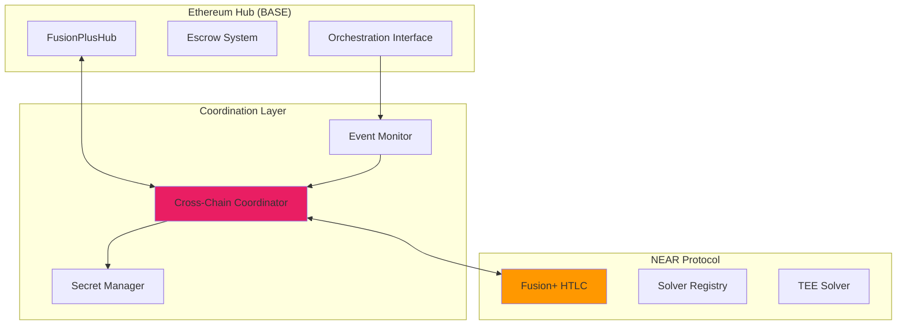
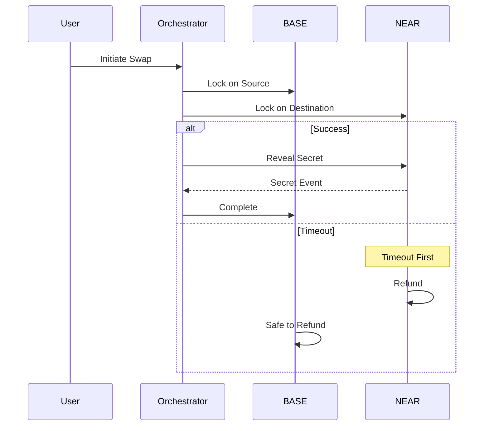

# NEAR Protocol Integration

## Overview

The NEAR Protocol integration extends 1Balancer's cross-chain capabilities to non-EVM chains, implementing both Fusion+ HTLC atomic swaps and a decentralized TEE solver. This document provides a high-level overview of the NEAR integration and references the detailed documentation in the `1balancer-near` repository.

## Architecture Summary

### Integration Architecture



## Key Components

### 1. NEAR HTLC Contract

The NEAR-side HTLC contract mirrors the Ethereum Hub's escrow functionality:

- **Hashlock/Timelock**: SHA-256 based atomic swap mechanism
- **NEP-141 Support**: Full fungible token standard compatibility
- **Cross-chain Events**: Coordinated event emission for monitoring

### 2. TEE Solver (Challenge 2)

Decentralized solver implementation using Trusted Execution Environments:

- **Phala Network Integration**: Secure enclave execution
- **Chain Signatures**: MPC-based cross-chain signing
- **Attestation Verification**: Trustless solver registration

### 3. Cross-Chain Coordination

The orchestration layer manages the atomic swap lifecycle:



## Timeout Coordination

Critical for atomicity - NEAR timeouts must expire before BASE:

```
NEAR:  |--Active--|--Refund-->
       0         T1         T2

BASE:  |--Active------------|--Refund-->
       0                   T3         T4

Where: T2 < T3 (ensures atomic execution)
```

## Integration Points

### 1. Orchestration Service

The orchestration service (`packages/orchestrator`) coordinates between chains:

```typescript
// Simplified integration interface
interface NEARIntegration {
    createHTLC(params: HTLCParams): Promise<string>;
    monitorEvents(callback: EventCallback): void;
    revealSecret(htlcId: string, secret: string): Promise<void>;
}
```

### 2. Event Monitoring

Events are monitored and correlated across both chains:

- **BASE Events**: `SrcEscrowCreated`, `SecretRevealed`
- **NEAR Events**: `HTLCCreated`, `HTLCWithdrawn`, `HTLCRefunded`

### 3. Frontend Integration

The frontend remains chain-agnostic:

```typescript
// User doesn't need to know about NEAR complexity
const swap = await portfolio.rebalance({
    from: 'BASE',
    to: 'NEAR',
    tokens: ['USDC', 'NEAR']
});
```

## Security Considerations

1. **Hashlock Security**: SHA-256 commitment scheme
2. **Timeout Safety**: NEAR expires first for atomicity
3. **TEE Isolation**: Solver runs in secure enclave
4. **Event Verification**: Cross-chain message validation

## Detailed Documentation

For comprehensive documentation on the NEAR integration:

### Architecture & Design
- [`1balancer-near/docs/ARCHITECTURE.md`](https://github.com/1balancer/1balancer-near/blob/main/docs/ARCHITECTURE.md) - Complete system architecture
- [`1balancer-near/docs/SYSTEM-ARCHITECTURE.md`](https://github.com/1balancer/1balancer-near/blob/main/docs/SYSTEM-ARCHITECTURE.md) - Detailed component diagrams
- [`1balancer-near/docs/CROSS-CHAIN-WORKFLOW.md`](https://github.com/1balancer/1balancer-near/blob/main/docs/CROSS-CHAIN-WORKFLOW.md) - Step-by-step swap flows

### Security & Development
- [`1balancer-near/docs/SECURITY-ARCHITECTURE.md`](https://github.com/1balancer/1balancer-near/blob/main/docs/SECURITY-ARCHITECTURE.md) - Security model and mitigations
- [`1balancer-near/docs/DEVELOPMENT.md`](https://github.com/1balancer/1balancer-near/blob/main/docs/DEVELOPMENT.md) - Development guide

### Deployment
- [`1balancer-near/docs/DEPLOYMENT-GUIDE.md`](https://github.com/1balancer/1balancer-near/blob/main/docs/DEPLOYMENT-GUIDE.md) - Production deployment instructions

### Contract Documentation
- [`1balancer-near/contracts/fusion-plus-htlc/README.md`](https://github.com/1balancer/1balancer-near/blob/main/contracts/fusion-plus-htlc/README.md) - HTLC contract details
- [`1balancer-near/shade-agent-solver/README.md`](https://github.com/1balancer/1balancer-near/blob/main/shade-agent-solver/README.md) - TEE solver implementation

## Quick Start

### For Developers

1. **Clone NEAR Repository**:
   ```bash
   git clone https://github.com/1balancer/1balancer-near.git
   cd 1balancer-near
   ```

2. **Install Dependencies**:
   ```bash
   # Rust 1.86.0 required
   rustup install 1.86.0
   rustup default 1.86.0
   make install
   ```

3. **Build Contracts**:
   ```bash
   make build
   ```

4. **Run Tests**:
   ```bash
   make test
   ```

### For Integration

1. **Update Orchestrator Config**:
   ```typescript
   // orchestrator/config/chains.ts
   export const chains = {
       base: { /* ... */ },
       near: {
           rpc: process.env.NEAR_RPC_URL,
           contracts: {
               htlc: process.env.NEAR_HTLC_CONTRACT
           }
       }
   };
   ```

2. **Start Monitoring**:
   ```bash
   npm run monitor:near
   ```

## Testing Cross-Chain Swaps

### Local Testing

```bash
# Terminal 1: Start local BASE chain
cd packages/hardhat
yarn chain

# Terminal 2: Start NEAR localnet
cd ../../../1balancer-near
npm run near:localnet

# Terminal 3: Deploy contracts
make deploy:local

# Terminal 4: Run integration tests
npm run test:cross-chain
```

### Testnet Testing

```bash
# Deploy to testnets
make deploy:testnet

# Run cross-chain test swap
npm run test:swap -- --from base-testnet --to near-testnet
```

## Monitoring and Debugging

### Health Check

```bash
curl http://localhost:8080/health/near

# Response
{
    "status": "healthy",
    "contracts": {
        "htlc": "operational",
        "solver": "active"
    },
    "lastBlock": 123456789
}
```

### Debug Commands

```bash
# View NEAR contract state
near view fusion-htlc.testnet get_stats

# Monitor events
npm run monitor:events -- --chain near

# Check cross-chain session
curl http://localhost:8080/api/v1/sessions/SESSION_ID
```

## Future Enhancements

1. **Additional Non-EVM Chains**: Sui, Aptos integration
2. **Advanced TEE Features**: Zero-knowledge proofs
3. **Liquidity Aggregation**: Cross-chain liquidity pools
4. **Batch Operations**: Multiple swaps in single transaction

## Conclusion

The NEAR integration demonstrates 1Balancer's ability to extend beyond EVM chains while maintaining security and atomicity. The modular architecture allows for easy addition of more non-EVM chains following the same pattern.

For detailed implementation and architecture documentation, refer to the [`1balancer-near`](https://github.com/1balancer/1balancer-near) repository.