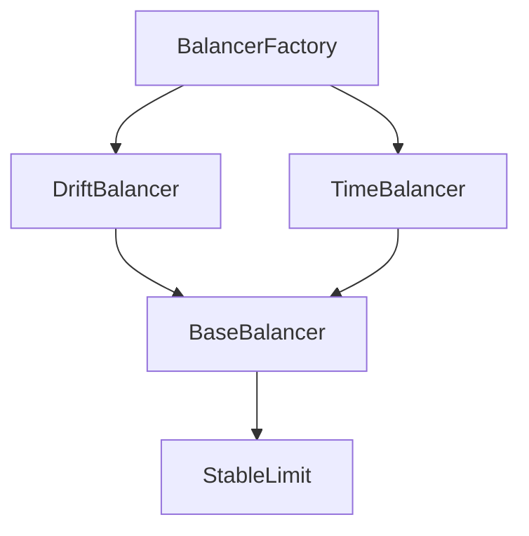

# Portfolio Management Contracts

This directory contains the 1Balancer core business logic for portfolio management. The system is designed for modularity, capital efficiency, and high composability using inheritance and separation of concerns.

---

## New Architecture with Chainlink Price Feeds

The system has been upgraded to integrate Chainlink price feeds for more accurate and reliable price data. This enables better decision-making for stablecoin rebalancing and portfolio management.

### Key Changes:

1. **ChainlinkPriceFeed Contract**: A new contract that implements the IPriceFeed interface to fetch prices from Chainlink aggregators.
2. **Stablecoin Separation**: Stablecoins are now managed separately from other assets, with dedicated logic in the StableLimit module.
3. **Price Feed Integration**: All balancer contracts now receive price feed addresses through the factory, ensuring consistent price data access.
4. **Enhanced Automation**: The StableLimit module now uses Chainlink Automation for more efficient and reliable upkeep checks.

---

## Contracts Description

### BalancerFactory

The `BalancerFactory` contract is responsible for creating user-owned balancer instances. Each instance represents a distinct portfolio management strategy, either time-based or drift-based.

#### Functions:

- `createBalancer(...)` → Deploys and initializes a new TimeBalancer or DriftBalancer instance.
- `getBalancer(address)` → Returns a specific balancer instance.
- `getBalancers()` → Returns all deployed balancer instances.
- `getBalancerCount()` → Returns the total number of balancers created.
- `getBalancersByOwner(address)` → Returns all balancers owned by a specific user.
- `getBalancersByOwnerAndName(address, string)` → Returns all balancers for an owner with the specified name.

---

### ChainlinkPriceFeed

A contract that implements the IPriceFeed interface to fetch prices from Chainlink aggregators. It supports multiple token pairs and provides a unified interface for price data access.

#### Functions:

- `getLatestPrice()` → Returns the latest ETH/USD price
- `getPrice(address token)` → Returns the price of a specific token in USD
- `getPrice(address base, address quote)` → Returns the price of a token pair
- `setPriceFeed(address token, address aggregator)` → Sets the Chainlink aggregator for a token
- `setPriceFeed(address base, address quote, address aggregator)` → Sets the Chainlink aggregator for a token pair

---

### StableLimit (inherits: `IERC1271`, `AutomationCompatibleInterface`)

A self-contained limit order engine that operates as a "micro-balancer" for stablecoins. This module is embedded in every balancer instance to manage stablecoin sub-allocations (e.g., USDC/USDT/DAI within a 30% stablecoin slice).

It automatically detects deviations in peg values using Chainlink Price Feeds and places signed limit orders (via EIP-1271) accordingly. It is periodically triggered by Chainlink Automation to minimize gas usage and operator overhead.

#### Stored Data:

- `stablecoins` → Array of stablecoin addresses
- `isStablecoin` → Mapping to check if an address is a stablecoin
- `priceFeed` → ChainlinkPriceFeed contract address
- `validOrders` → Map of signed order hashes to active status
- `expiration` → Order hash expiry timestamps
- `lastCheck`, `interval` → Chainlink Automation scheduling

#### Functions:

- `checkUpkeep()` → Chainlink Automation: determine if rebalancing is due
- `performUpkeep()` → Called periodically to check price drift and place limit orders
- `isValidSignature(bytes32 hash, bytes)` → Implements EIP-1271 for 1inch Limit Order Protocol validation
- `_placeLimitOrder(...)` → Internal helper to compute, hash, and store signed limit orders
- `checkAssetBalance(...)` → New function to check if an asset's balance is within acceptable percentage range based on price

---

### BaseBalancer (inherits: `StableLimit`)

This abstract base contract defines shared portfolio logic for percentage-based allocations. It delegates stablecoin rebalancing to `StableLimit` and focuses on overall portfolio-wide token value tracking.

#### Stored Data:

- `name`, `description` → Metadata
- `owner` → Creator/owner of this balancer

---

### BaseBalancer (inherits: `StableLimit`)

This abstract base contract defines shared portfolio logic for percentage-based allocations. It delegates stablecoin rebalancing to `StableLimit` and focuses on overall portfolio-wide token value tracking.

#### Stored Data:

- `name`, `description` → Metadata
- `owner` → Creator/owner of this balancer
- `tokens[]` → List of all assets in the portfolio
- `percentages[]` → Target allocation per token
- `wallet` → Token-holding address (usually the contract itself)
- `priceFeed` → 1inch Price Aggregator
- `totalValue` → Total portfolio valuation in a common unit

#### Functions:

- `setPercentages(address[] tokens, uint256[] percentages)` → Configure target distribution
- `fundWallet()` → Add funds in correct proportions
- `withdrawFunds()` → Extract assets proportionally
- `comparePercentages()` → Check current balance vs. target and return imbalance report

---

### DriftBalancer (inherits: `BaseBalancer`)

Implements value-based rebalancing. When token allocations drift beyond a set threshold, it generates limit orders via the embedded `StableLimit` module.

#### Characteristics:

- Passive, price-sensitive strategy
- Suitable for volatile markets with auto-correction needs
- Relies on 1inch for trade execution and on-chain oracles for drift detection

---

### TimeBalancer (inherits: `BaseBalancer`)

Implements time-based rebalancing logic using Chainlink Automation. Rebalancing occurs at regular intervals, regardless of market movement.

#### Characteristics:

- Predictable and consistent schedule
- Less sensitive to volatility, more user-configurable
- Optionally uses 1inch Fusion or Limit Orders for rebalancing

---

## System Inheritance Overview

