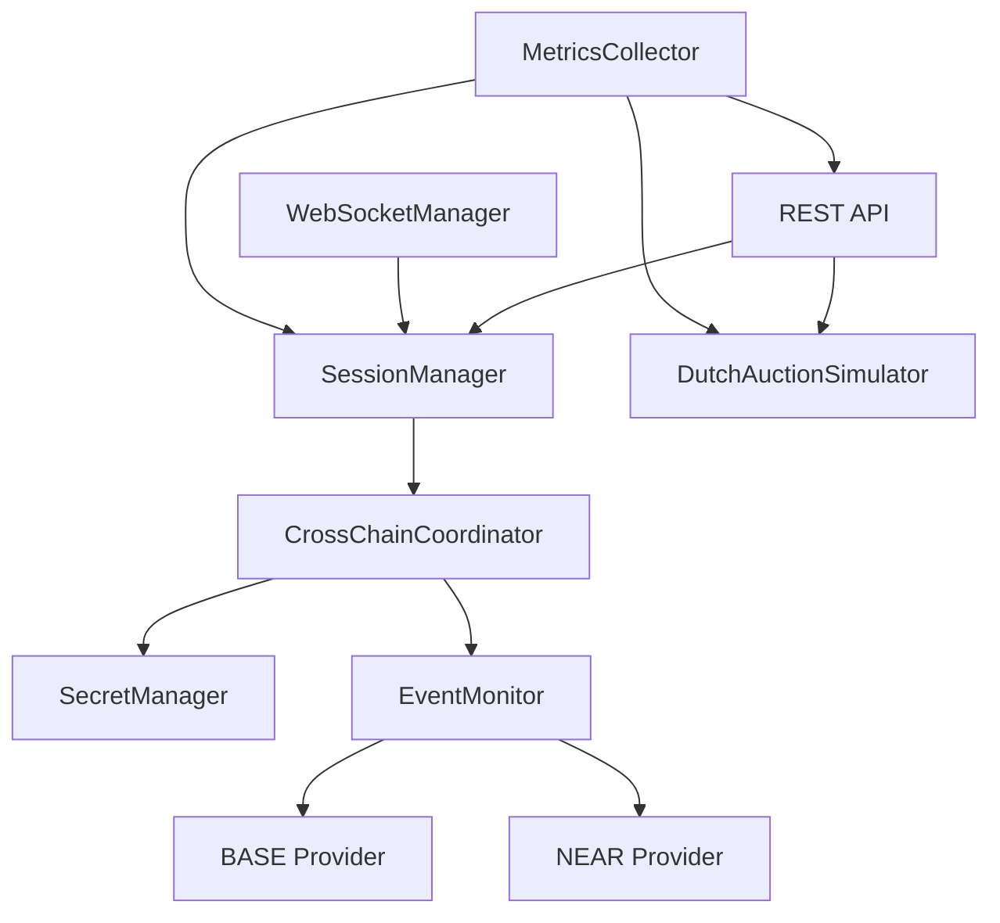
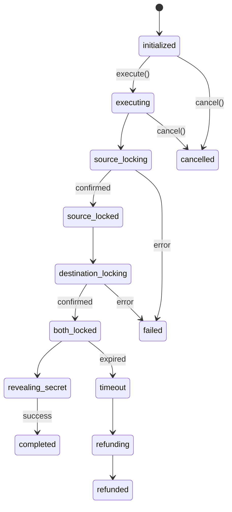

# Orchestrator Service Architecture

## Table of Contents
1. [Overview](#overview)
2. [System Architecture](#system-architecture)
3. [Component Architecture](#component-architecture)
4. [Data Flow Architecture](#data-flow-architecture)
5. [Event-Driven Architecture](#event-driven-architecture)
6. [Security Architecture](#security-architecture)
7. [Integration Architecture](#integration-architecture)

## Overview

The Orchestrator Service is the central coordination layer in the 1Balancer three-layer architecture. It manages cross-chain atomic swaps between BASE (EVM) and NEAR Protocol without requiring KYC or official resolver status.

### Key Architectural Principles

1. **Stateless Design**: Service can be horizontally scaled
2. **Event-Driven**: Reacts to blockchain events for coordination
3. **Fail-Safe**: Timeouts and cancellation mechanisms prevent fund locks
4. **Modular**: Clean separation between core components
5. **Observable**: Comprehensive metrics and logging

## System Architecture

```
┌─────────────────────────────────────────────────────────────────────┐
│                        1Balancer Architecture                       │
├─────────────────────────────────────────────────────────────────────┤
│                                                                     │
│  ┌─────────────────┐                      ┌──────────────────┐      │
│  │                 │  HTTP/WebSocket      │                  │      │
│  │  Frontend (UI)  │◄────────────────────►│   Orchestrator   │      │
│  │                 │                      │    Service       │      │
│  └─────────────────┘                      └──────┬───────────┘      │
│                                                  │                  │
│                                                  │ Events/RPC       │
│                                                  │                  │
│  ┌─────────────────┐                      ┌─────▼───────────┐       │
│  │                 │                      │                 │       │
│  │  BASE Contracts │◄────────────────────►│  NEAR Contracts │       │
│  │  (Ethereum Hub) │   Cross-Chain HTLC   │                 │       │
│  └─────────────────┘                      └─────────────────┘       │
│                                                                     │
└─────────────────────────────────────────────────────────────────────┘
```

### Service Boundaries

| Layer | Responsibility | Technology |
|-------|---------------|------------|
| Application | User Interface | Next.js, React |
| Orchestration | Coordination & State | Node.js, Express |
| Protocol | Smart Contracts | Solidity, Rust |

## Component Architecture

### Core Components

```
orchestrator/
├── src/
│   ├── core/                    # Core business logic
│   │   ├── SessionManager.ts    # Swap session lifecycle
│   │   ├── DutchAuctionSimulator.ts  # Price discovery
│   │   ├── SecretManager.ts     # HTLC secret management
│   │   └── CrossChainCoordinator.ts  # Atomic swap logic
│   │
│   ├── services/               # Infrastructure services
│   │   ├── EventMonitor.ts     # Blockchain event monitoring
│   │   ├── WebSocketManager.ts # Real-time communications
│   │   └── MetricsCollector.ts # Performance metrics
│   │
│   ├── api/                    # REST API layer
│   │   ├── routes/            # API endpoints
│   │   └── middleware/        # Express middleware
│   │
│   └── utils/                 # Shared utilities
```

### Component Interactions



### Component Responsibilities

#### SessionManager
- Manages swap session lifecycle
- Tracks session states and transitions
- Handles timeout and expiration
- Provides session persistence (in-memory/Redis)

```typescript
interface SwapSession {
  sessionId: string;
  status: SessionStatus;
  sourceChain: string;
  destinationChain: string;
  // ... full state tracking
}
```

#### DutchAuctionSimulator
- Simulates resolver pricing without KYC
- Calculates dynamic pricing based on urgency
- Manages price feeds and market data
- Provides quote generation

```typescript
interface SimulatedQuote {
  sourceAmount: string;
  destinationAmount: string;
  dutchAuction: {
    startPrice: string;
    endPrice: string;
    duration: number;
  };
}
```

#### SecretManager
- Generates cryptographically secure secrets
- Encrypts secrets at rest (AES-256-GCM)
- Manages one-time reveal mechanism
- Handles secret expiration

```typescript
interface SecretPair {
  secret: string;    // 32-byte hex
  hash: string;      // SHA-256 hash
}
```

#### CrossChainCoordinator
- Orchestrates atomic swap execution
- Manages cross-chain state synchronization
- Handles failure scenarios
- Coordinates timeout mechanisms

## Data Flow Architecture

### Swap Execution Flow

```
1. Session Creation
   Frontend → POST /api/v1/sessions → SessionManager
   └─> Generate secret/hash
   └─> Initialize session state
   └─> Return session ID

2. Price Quote
   Frontend → POST /api/v1/quote → DutchAuctionSimulator
   └─> Fetch market prices
   └─> Calculate Dutch auction parameters
   └─> Return quote with fees

3. Swap Execution
   Frontend → POST /api/v1/sessions/:id/execute → CrossChainCoordinator
   └─> Lock on source chain (BASE)
   └─> Monitor source events
   └─> Trigger destination lock (NEAR)
   └─> Coordinate secret reveal

4. Completion
   EventMonitor → Secret revealed event → SessionManager
   └─> Update session status
   └─> Notify via WebSocket
   └─> Clean up resources
```

### State Transitions



## Event-Driven Architecture

### Event Sources

1. **Blockchain Events**
   - EscrowFactory: `SrcEscrowCreated`, `DstEscrowCreated`
   - Escrow contracts: `Withdrawn`, `Cancelled`
   - HTLC contracts: State changes

2. **Internal Events**
   - Session state changes
   - Price updates
   - System alerts

### Event Processing

```typescript
// Event monitoring pattern
class EventMonitor {
  async processLog(chain: string, log: Log) {
    const event = parseLog(log);
    
    switch(event.name) {
      case 'SrcEscrowCreated':
        await coordinator.handleEscrowCreated(event);
        break;
      case 'SecretRevealed':
        await coordinator.handleSecretRevealed(event);
        break;
    }
  }
}
```

### WebSocket Events

```typescript
// Real-time updates
interface SessionUpdate {
  type: 'session_update';
  sessionId: string;
  status: SessionStatus;
  data: {
    phase: string;
    progress: number;
  };
}
```

## Security Architecture

### Authentication Layers

1. **API Authentication**
   - API key validation
   - JWT token support
   - Per-endpoint permissions

2. **WebSocket Authentication**
   - Connection-level auth
   - Channel-based permissions
   - Rate limiting per connection

### Security Measures

```typescript
// Rate limiting configuration
const rateLimiter = rateLimit({
  windowMs: 15 * 60 * 1000,  // 15 minutes
  max: 100,                   // 100 requests
  keyGenerator: (req) => req.apiKey || req.ip
});

// Input validation
const sessionSchema = Joi.object({
  sourceChain: Joi.string().valid('base', 'ethereum'),
  sourceToken: Joi.string().pattern(/^0x[a-fA-F0-9]{40}$/),
  // ... comprehensive validation
});
```

### Secret Management

```typescript
// Encryption at rest
class SecretManager {
  private encryptionKey: Buffer;
  
  async encrypt(data: Buffer): Promise<EncryptedData> {
    const iv = randomBytes(16);
    const cipher = createCipheriv('aes-256-gcm', this.encryptionKey, iv);
    // ... secure encryption
  }
}
```

## Integration Architecture

### Contract Integration

```typescript
// BASE chain integration
const escrowFactory = new Contract(
  ESCROW_FACTORY_ADDRESS,
  escrowFactoryAbi,
  provider
);

// Event subscription
escrowFactory.on('SrcEscrowCreated', async (event) => {
  await handleEscrowCreated(event);
});
```

### NEAR Integration

```typescript
// NEAR RPC polling
async pollNear() {
  const response = await axios.post(NEAR_RPC_URL, {
    method: 'query',
    params: {
      request_type: 'view_state',
      account_id: HTLC_CONTRACT,
    }
  });
  
  // Process state changes
}
```

### Frontend Integration

```typescript
// Client SDK example
class OrchestrationClient {
  async createSwap(params: SwapParams): Promise<Session> {
    const response = await fetch('/api/v1/sessions', {
      method: 'POST',
      headers: { 'X-API-Key': this.apiKey },
      body: JSON.stringify(params)
    });
    
    const session = await response.json();
    this.subscribeToUpdates(session.sessionId);
    return session;
  }
}
```

### 1inch Integration

```typescript
// Via proxy service
const quote = await fetch(`${PROXY_URL}/api/1inch/quote`, {
  headers: { 'Authorization': `Bearer ${ONEINCH_API_KEY}` }
});
```

## Performance Architecture

### Scaling Considerations

1. **Horizontal Scaling**
   - Stateless service design
   - Redis for shared state
   - Load balancer compatible

2. **Caching Strategy**
   - Price quotes: 30-second cache
   - Session data: In-memory/Redis
   - Contract state: Event-driven updates

3. **Resource Management**
   - Connection pooling for RPC
   - WebSocket connection limits
   - Memory-efficient event processing

### Monitoring Architecture

```typescript
// Metrics collection
class MetricsCollector {
  // Counters
  swapsInitiated: Counter;
  swapsCompleted: Counter;
  swapsFailed: Counter;
  
  // Histograms
  apiLatency: Histogram;
  swapDuration: Histogram;
  
  // Gauges
  activeSwaps: Gauge;
  connectedClients: Gauge;
}
```

## Deployment Architecture

### Container Architecture

```yaml
services:
  orchestrator:
    build: ./packages/orchestrator
    ports:
      - "8080:8080"
    environment:
      - NODE_ENV=production
      - BASE_RPC_URL=${BASE_RPC_URL}
      - NEAR_RPC_URL=${NEAR_RPC_URL}
    depends_on:
      - redis
    
  redis:
    image: redis:alpine
    volumes:
      - redis_data:/data
```

### Health Monitoring

```typescript
// Health check endpoint
GET /health
{
  "status": "healthy",
  "connections": {
    "base": true,
    "near": true,
    "redis": true
  },
  "metrics": {
    "activeSwaps": 5,
    "uptime": 3600
  }
}
```

## Error Handling Architecture

### Error Boundaries

1. **API Layer**: Validation errors, auth failures
2. **Business Logic**: Invalid states, timeout handling
3. **Integration Layer**: Network errors, blockchain failures

### Recovery Mechanisms

```typescript
// Retry with exponential backoff
async handleWithRetry(fn: () => Promise<void>) {
  const operation = retry.operation({
    retries: 3,
    factor: 2,
    minTimeout: 1000
  });
  
  return new Promise((resolve, reject) => {
    operation.attempt(async () => {
      try {
        await fn();
        resolve();
      } catch (error) {
        if (!operation.retry(error)) {
          reject(operation.mainError());
        }
      }
    });
  });
}
```

## Future Architecture Considerations

1. **Multi-Region Deployment**
   - Geographic distribution
   - Regional RPC endpoints
   - Cross-region state sync

2. **Advanced Features**
   - Multi-hop swaps
   - Batch processing
   - MEV protection

3. **Protocol Extensions**
   - Additional chains
   - New swap types
   - Advanced pricing models