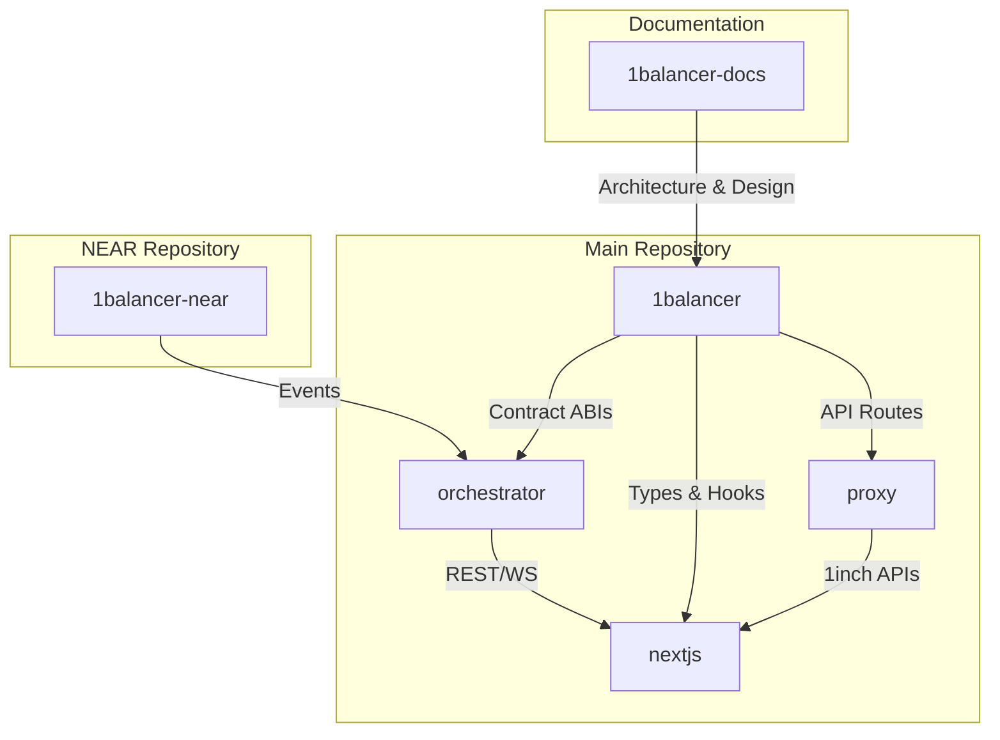
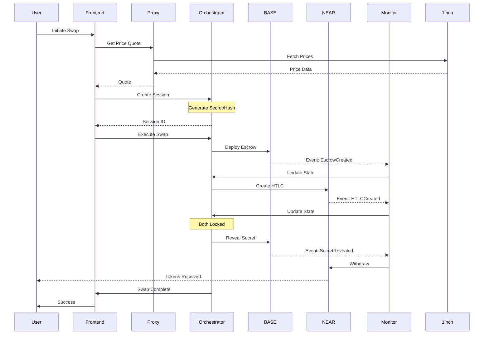

# 1Balancer Complete System Architecture

## Table of Contents
1. [System Overview](#system-overview)
2. [Multi-Repository Architecture](#multi-repository-architecture)
3. [Service Communication Architecture](#service-communication-architecture)
4. [Data Flow Architecture](#data-flow-architecture)
5. [Cross-Chain Protocol Architecture](#cross-chain-protocol-architecture)
6. [Security Architecture](#security-architecture)
7. [Deployment Architecture](#deployment-architecture)
8. [Integration Points](#integration-points)

## System Overview

1Balancer is a cross-chain atomic swap protocol enabling trustless exchanges between BASE (EVM) and NEAR Protocol without KYC requirements. The system implements the 1inch Fusion+ challenge using a three-layer architecture pattern.

### High-Level Architecture

```
┌─────────────────────────────────────────────────────────────────────────────┐
│                           1Balancer System Architecture                     │
├─────────────────────────────────────────────────────────────────────────────┤
│                                                                             │
│  ┌──────────────────┐     ┌──────────────────┐     ┌──────────────────┐     │
│  │                  │     │                  │     │                  │     │
│  │  Frontend (UI)   │────▶│  Proxy Service   │────▶│  1inch APIs      │     │
│  │  Next.js/React   │     │  CORS Handler    │     │  Price/Swap      │     │
│  │                  │     │                  │     │                  │     │
│  └────────┬─────────┘     └──────────────────┘     └──────────────────┘     │
│           │                                                                 │
│           │ REST/WebSocket                                                  │
│           ▼                                                                 │
│  ┌──────────────────────────────────────────────────────────────────────┐   │
│  │                     Orchestration Service (Node.js)                  │   │
│  ├──────────────────────────────────────────────────────────────────────┤   │
│  │  • Session Management    • Dutch Auction Simulation                  │   │
│  │  • Secret Management     • Cross-Chain Coordination                  │   │
│  │  • Event Monitoring      • WebSocket Real-time Updates               │   │
│  └────────┬─────────────────────────────────────────────────────────────┘   │
│           │                                                                 │
│           │ Events/RPC                                                      │
│           ▼                                                                 │
│  ┌──────────────────────┐                    ┌──────────────────────┐       │
│  │                      │                    │                      │       │
│  │  BASE Chain (EVM)    │◄──────HTLC────────▶│  NEAR Protocol       │       │
│  │  • Escrow Contracts  │                    │  • HTLC Contracts    │       │
│  │  • 1inch Integration │                    │  • NEP-141 Tokens    │       │
│  │                      │                    │                      │       │
│  └──────────────────────┘                    └──────────────────────┘       │
│                                                                             │
└─────────────────────────────────────────────────────────────────────────────┘
```

### Core Principles

1. **Decentralized**: No central authority or KYC requirements
2. **Atomic**: Swaps complete entirely or fail with refunds
3. **Trustless**: Cryptographic guarantees via HTLC
4. **Efficient**: Optimized gas usage and minimal steps
5. **User-Friendly**: Simple portfolio interface

## Multi-Repository Architecture

### Repository Structure

```
1balancer/                          # Main implementation repository
├── packages/
│   ├── nextjs/                    # Frontend application
│   │   ├── app/                   # Next.js 13+ app directory
│   │   ├── components/            # React components
│   │   ├── hooks/                 # Custom React hooks
│   │   └── utils/                 # Frontend utilities
│   │
│   ├── hardhat/                   # Smart contracts
│   │   ├── contracts/
│   │   │   ├── ethereum-hub/      # BASE chain contracts
│   │   │   ├── foundation/        # 1inch integrations
│   │   │   └── portfolio/         # Portfolio management
│   │   ├── deploy/                # Deployment scripts
│   │   └── test/                  # Contract tests
│   │
│   ├── proxy/                     # CORS proxy service
│   │   ├── api/                   # API routes
│   │   ├── middleware/            # Express middleware
│   │   └── config/                # Environment configs
│   │
│   └── orchestrator/              # Orchestration service
│       ├── src/
│       │   ├── core/              # Business logic
│       │   ├── services/          # Infrastructure
│       │   └── api/               # REST endpoints
│       └── docs/                  # Service documentation

1balancer-near/                    # NEAR Protocol implementation
├── contracts/                     # Rust smart contracts
│   ├── htlc/                     # HTLC implementation
│   ├── resolver/                 # Cross-chain resolver
│   └── treasury/                 # Fee management
├── bridge/                       # TypeScript bridge service
└── tests/                        # Integration tests

1balancer-docs/                   # Documentation repository
├── docs/                         # Organized documentation
│   ├── raw/                     # Original sources
│   ├── sections/                # Categorized docs
│   ├── solution/                # Architecture decisions
│   └── reports/                 # Analysis reports
├── git/                         # Research repositories
└── rules/                       # Development patterns
```

### Repository Relationships



## Service Communication Architecture

### Inter-Service Communication

```
┌─────────────────────────────────────────────────────────────────────┐
│                        Communication Flow                            │
├─────────────────────────────────────────────────────────────────────┤
│                                                                      │
│  Frontend (3000)          Proxy (3001)         Orchestrator (8080)   │
│       │                      │                        │              │
│       ├──────REST API────────┼───────────────────────►              │
│       │                      │                        │              │
│       ├──────WebSocket───────┼───────────────────────►              │
│       │                      │                        │              │
│       ├──────1inch API───────►──────Forward──────────►              │
│       │                      │                        │              │
│       │                      │                        ├──────┐       │
│       │                      │                        │      │       │
│       │                      │                   Event Monitor       │
│       │                      │                        │      │       │
│       │                      │                        ▼      ▼       │
│       │                      │                     BASE    NEAR      │
│                                                                      │
└──────────────────────────────────────────────────────────────────────┘
```

### API Communication Patterns

#### REST API Pattern
```typescript
// Frontend → Orchestrator
POST http://localhost:8080/api/v1/sessions
Headers: {
  'X-API-Key': 'api-key',
  'Content-Type': 'application/json'
}
Body: {
  sourceChain: 'base',
  destinationChain: 'near',
  ...
}

// Response flow
Orchestrator → Session Manager → Database → Response → Frontend
```

#### WebSocket Pattern
```typescript
// Real-time updates
WebSocket: ws://localhost:8080/ws

// Message flow
Frontend → Connect → Authenticate → Subscribe → Receive Updates
                                               ↑
                                    Event Monitor → State Change
```

#### Proxy Pattern
```typescript
// 1inch API requests
Frontend → http://localhost:3001/api/1inch/quote
         ↓
    Proxy Service → Add API Key → Forward → 1inch API
         ↓
    Transform Response → Cache → Return to Frontend
```

## Data Flow Architecture

### Swap Execution Data Flow



### State Synchronization Flow

```
┌─────────────────────────────────────────────────────────────────┐
│                    State Synchronization                         │
├─────────────────────────────────────────────────────────────────┤
│                                                                  │
│  Session State (Orchestrator)                                    │
│       │                                                          │
│       ├── In-Memory Store ←─── Redis (Production)               │
│       │                                                          │
│       └── Updates ──┬── WebSocket ──→ Frontend State            │
│                     │                                            │
│                     ├── Events ─────→ Blockchain State          │
│                     │                                            │
│                     └── Metrics ────→ Monitoring State          │
│                                                                  │
└──────────────────────────────────────────────────────────────────┘
```

## Cross-Chain Protocol Architecture

### HTLC Implementation

```
BASE Chain (Solidity)                    NEAR Chain (Rust)
┌─────────────────────┐                 ┌─────────────────────┐
│  EscrowSrc.sol      │                 │  htlc_contract.rs   │
├─────────────────────┤                 ├─────────────────────┤
│ • Lock tokens       │                 │ • Lock NEP-141      │
│ • Verify hashlock   │◄───Hashlock─────│ • Verify hashlock   │
│ • Timeout: T1       │                 │ • Timeout: T2 < T1  │
│ • Reveal secret     │────Secret──────▶│ • Use secret        │
│ • Withdraw/Cancel   │                 │ • Withdraw/Cancel   │
└─────────────────────┘                 └─────────────────────┘
```

### Timeout Coordination

```
Timeline:
0 ─────── T2' ─────── T1 ─────── T2 ─────── T3
│         │           │          │           │
│         │           │          │           └─ Src Cancellation
│         │           │          └──────────── Dst Cancellation  
│         │           └─────────────────────── Src Withdrawal
│         └─────────────────────────────────── Dst Withdrawal
│
└─ Swap Initiated

Critical: T2' < T1 ensures atomicity
```

### Cross-Chain Event Flow

```typescript
// Event correlation
class CrossChainEventFlow {
  // BASE events
  onSrcEscrowCreated(event) {
    // 1. Store escrow address
    // 2. Update session state
    // 3. Trigger NEAR HTLC creation
  }
  
  // NEAR events (polled)
  onNearHTLCCreated(state) {
    // 1. Verify hashlock match
    // 2. Update session state
    // 3. Enable secret reveal
  }
  
  // Secret revelation
  onSecretRevealed(event) {
    // 1. Extract secret
    // 2. Trigger NEAR withdrawal
    // 3. Complete swap
  }
}
```

## Security Architecture

### Multi-Layer Security

```
┌─────────────────────────────────────────────────────────────────┐
│                      Security Layers                            │
├─────────────────────────────────────────────────────────────────┤
│                                                                 │
│  Application Layer                                              │
│  ├── Input validation (Joi schemas)                             │
│  ├── Rate limiting (per IP/API key)                             │
│  └── CORS protection                                            │
│                                                                 │
│  Service Layer                                                  │
│  ├── API authentication (API keys/JWT)                          │
│  ├── Secret encryption (AES-256-GCM)                            │
│  └── Session isolation                                          │
│                                                                 │
│  Protocol Layer                                                 │
│  ├── HTLC cryptographic guarantees                              │
│  ├── Timeout protection                                         │
│  └── Atomic execution                                           │
│                                                                 │
│  Infrastructure Layer                                           │
│  ├── TLS/SSL encryption                                         │
│  ├── Environment isolation                                      │
│  └── Access logging                                             │
│                                                                 │
└─────────────────────────────────────────────────────────────────┘
```

### Threat Model & Mitigations

| Threat | Mitigation |
|--------|------------|
| Front-running | Commit-reveal pattern, private mempools |
| Timeout attacks | Conservative timeout margins |
| Secret exposure | One-time reveal, encrypted storage |
| Replay attacks | Nonce tracking, unique session IDs |
| Chain reorgs | Confirmation requirements |
| API abuse | Rate limiting, authentication |

## Deployment Architecture

### Development Environment

```yaml
# docker-compose.yml
version: '3.8'
services:
  frontend:
    build: ./packages/nextjs
    ports:
      - "3000:3000"
    environment:
      - NEXT_PUBLIC_ORCHESTRATOR_URL=http://localhost:8080
    
  orchestrator:
    build: ./packages/orchestrator
    ports:
      - "8080:8080"
    depends_on:
      - redis
    environment:
      - BASE_RPC_URL=${BASE_RPC_URL}
      - NEAR_RPC_URL=${NEAR_RPC_URL}
  
  proxy:
    build: ./packages/proxy
    ports:
      - "3001:3001"
    environment:
      - ONEINCH_API_KEY=${ONEINCH_API_KEY}
  
  redis:
    image: redis:alpine
    ports:
      - "6379:6379"
  
  hardhat:
    build: ./packages/hardhat
    ports:
      - "8545:8545"
    command: npx hardhat node
```

### Production Architecture

```
┌─────────────────────────────────────────────────────────────────┐
│                   Production Deployment                         │
├─────────────────────────────────────────────────────────────────┤
│                                                                 │
│  Load Balancer (Nginx/CloudFlare)                               │
│       │                                                         │
│       ├── Frontend (Multiple Instances)                         │
│       │   └── CDN for static assets                             │
│       │                                                         │
│       ├── Orchestrator (Multiple Instances)                     │
│       │   ├── Redis Cluster (Session State)                     │
│       │   └── Event Queue (Pub/Sub)                             │
│       │                                                         │
│       └── Proxy Service (Cached)                                │
│                                                                 │
│  External Services                                              │
│       ├── BASE RPC (Alchemy/Infura)                             │
│       ├── NEAR RPC (Official)                                   │
│       └── 1inch API                                             │
│                                                                 │
└─────────────────────────────────────────────────────────────────┘
```

### Kubernetes Deployment

```yaml
# orchestrator-deployment.yaml
apiVersion: apps/v1
kind: Deployment
metadata:
  name: orchestrator
spec:
  replicas: 3
  selector:
    matchLabels:
      app: orchestrator
  template:
    metadata:
      labels:
        app: orchestrator
    spec:
      containers:
      - name: orchestrator
        image: 1balancer/orchestrator:latest
        ports:
        - containerPort: 8080
        env:
        - name: NODE_ENV
          value: production
        - name: REDIS_URL
          valueFrom:
            secretKeyRef:
              name: orchestrator-secrets
              key: redis-url
        resources:
          requests:
            memory: "256Mi"
            cpu: "250m"
          limits:
            memory: "512Mi"
            cpu: "500m"
---
apiVersion: v1
kind: Service
metadata:
  name: orchestrator-service
spec:
  selector:
    app: orchestrator
  ports:
  - port: 8080
    targetPort: 8080
  type: ClusterIP
```

## Integration Points

### Frontend Integration

```typescript
// Frontend SDK usage
import { OrchestrationClient } from '@1balancer/sdk';

const client = new OrchestrationClient({
  baseUrl: process.env.NEXT_PUBLIC_ORCHESTRATOR_URL,
  apiKey: process.env.NEXT_PUBLIC_API_KEY
});

// Create swap
const session = await client.createSwap({
  sourceChain: 'base',
  destinationChain: 'near',
  sourceToken: USDC_ADDRESS,
  destinationToken: 'usdt.near',
  amount: parseUnits('100', 6)
});

// Monitor progress
client.on('session:update', (update) => {
  updateUI(update);
});
```

### Smart Contract Integration

```solidity
// Contract interaction pattern
interface I1BalancerIntegration {
    function initiateSwap(
        address token,
        uint256 amount,
        bytes32 hashlockHash,
        address nearRecipient
    ) external returns (address escrow);
    
    function completeSwap(
        address escrow,
        bytes32 secret
    ) external;
}
```

### NEAR Integration

```rust
// NEAR contract integration
#[near_bindgen]
impl HTLCContract {
    pub fn create_htlc(
        &mut self,
        receiver: AccountId,
        hashlock: Base64VecU8,
        timelock: u64,
        token_id: AccountId,
        amount: U128
    ) -> HTLCId {
        // Implementation
    }
}
```

### Monitoring Integration

```typescript
// Prometheus metrics
app.get('/metrics', (req, res) => {
  res.set('Content-Type', register.contentType);
  res.end(register.metrics());
});

// Grafana dashboard
{
  "dashboard": {
    "title": "1Balancer Metrics",
    "panels": [
      {
        "title": "Active Swaps",
        "targets": [
          {
            "expr": "orchestrator_active_swaps"
          }
        ]
      }
    ]
  }
}
```

## System Requirements

### Development Requirements
- Node.js 18+
- Rust 1.86.0 (for NEAR)
- Docker & Docker Compose
- 8GB RAM minimum
- 20GB disk space

### Production Requirements
- Kubernetes cluster or Docker Swarm
- Redis cluster for state
- SSL certificates
- Monitoring stack (Prometheus/Grafana)
- Log aggregation (ELK/Datadog)
- High-availability RPC endpoints

### Network Requirements
- BASE Sepolia testnet access
- NEAR testnet access
- 1inch API access (hackathon key)
- Low-latency connections to RPC nodes