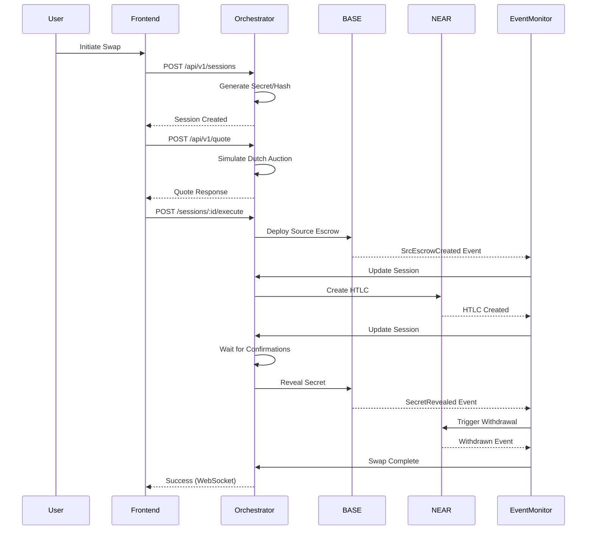
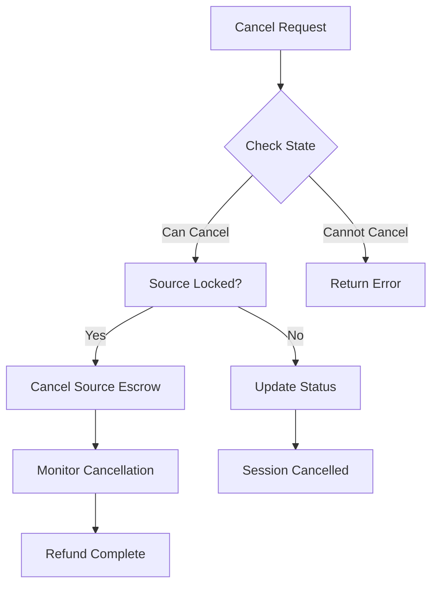
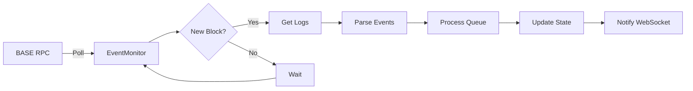
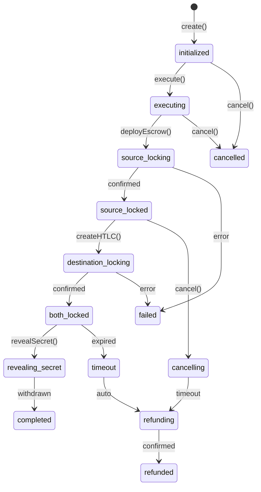
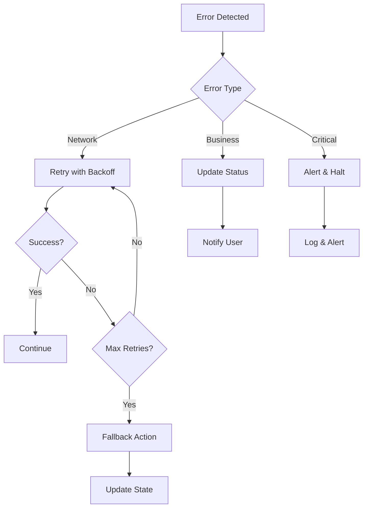
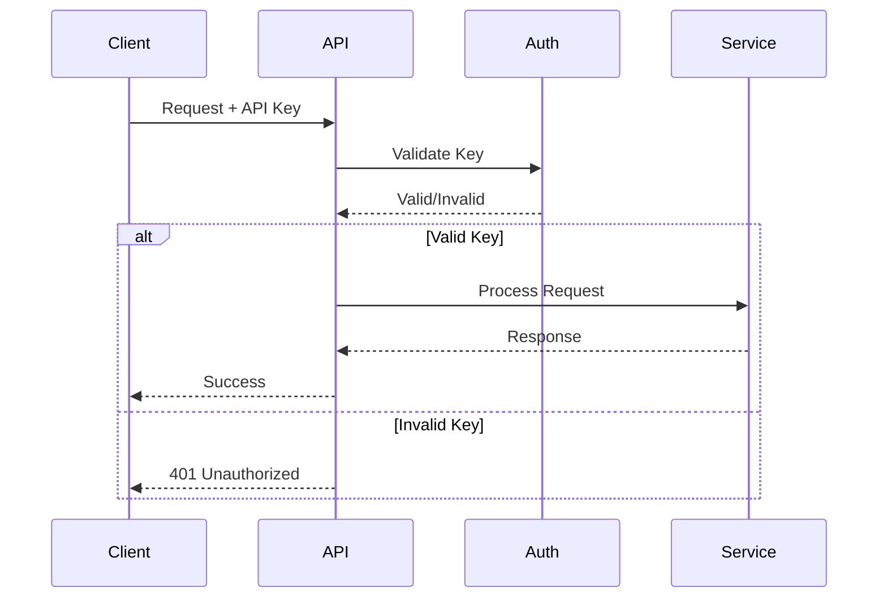
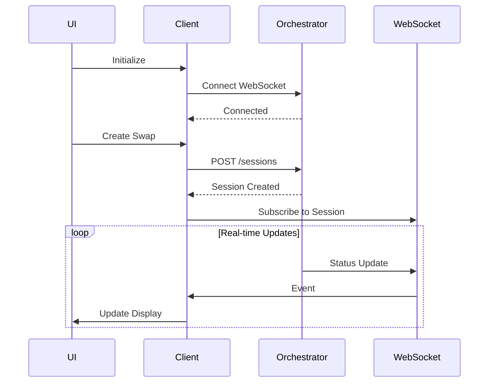
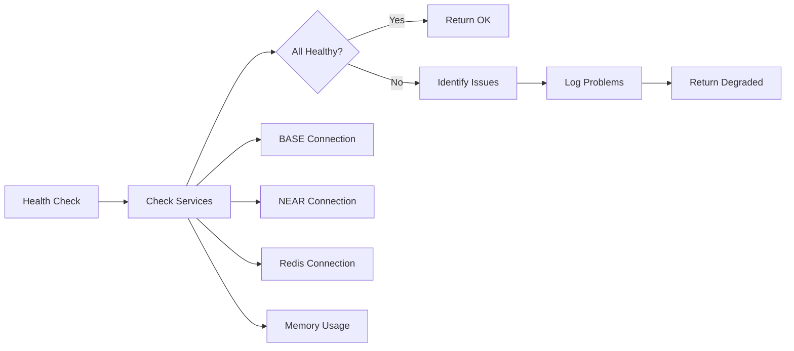

# Orchestrator Service Workflows

## Table of Contents
1. [Swap Execution Workflow](#swap-execution-workflow)
2. [Event Processing Workflow](#event-processing-workflow)
3. [State Management Workflow](#state-management-workflow)
4. [Error Handling Workflow](#error-handling-workflow)
5. [Security Workflows](#security-workflows)
6. [Integration Workflows](#integration-workflows)
7. [Monitoring Workflows](#monitoring-workflows)

## Swap Execution Workflow

### Complete Swap Flow



### Detailed Step Breakdown

#### 1. Session Creation
```typescript
// Frontend request
POST /api/v1/sessions
{
  "sourceChain": "base",
  "destinationChain": "near",
  "sourceToken": "0x...",
  "destinationToken": "usdt.near",
  "sourceAmount": "1000000000",
  "destinationAmount": "999000000",
  "maker": "0x...",
  "taker": "alice.near",
  "slippageTolerance": 100
}

// Orchestrator processing
1. Validate input parameters
2. Check session limits
3. Generate cryptographic secret
4. Calculate hashlock (SHA-256)
5. Create session with unique ID
6. Initialize state machine
7. Return session details
```

#### 2. Price Discovery
```typescript
// Dutch Auction Simulation
1. Fetch current market price
2. Apply urgency multiplier
3. Calculate start price (market + premium)
4. Calculate end price (market - discount)
5. Set auction duration
6. Calculate current price point
7. Apply fees (protocol + network)
8. Return quote with validity period
```

#### 3. Swap Execution
```typescript
// Execution phases
Phase 1: Source Locking
- Validate limit order
- Deploy escrow contract
- Lock tokens in escrow
- Wait for confirmations
- Update session state

Phase 2: Destination Locking
- Monitor source events
- Trigger NEAR HTLC creation
- Verify hashlock match
- Confirm timeout alignment
- Update session state

Phase 3: Secret Revelation
- Wait for both locks
- Reveal secret on source
- Monitor revelation event
- Trigger destination withdrawal
- Complete swap
```

### Cancellation Flow



## Event Processing Workflow

### Event Monitoring Architecture

```typescript
// Event processing pipeline
class EventMonitor {
  // 1. Setup listeners
  setupEventListeners(contract: Contract) {
    contract.on('SrcEscrowCreated', this.handleEscrowCreated);
    contract.on('SecretRevealed', this.handleSecretRevealed);
    contract.on('Cancelled', this.handleCancellation);
  }
  
  // 2. Process events with retry
  async processEvent(event: Event) {
    await this.validateEvent(event);
    await this.updateSessionState(event);
    await this.triggerNextAction(event);
    await this.notifyClients(event);
  }
  
  // 3. Handle reorgs
  async handleReorg(blockNumber: number) {
    const events = await this.getEventsAfter(blockNumber);
    await this.reprocessEvents(events);
  }
}
```

### BASE Chain Monitoring



### NEAR Chain Monitoring

```typescript
// NEAR polling workflow
async pollNear() {
  // 1. Query contract state
  const state = await nearRpc.query({
    request_type: 'view_state',
    account_id: HTLC_CONTRACT,
    method_name: 'get_active_htlcs'
  });
  
  // 2. Compare with cached state
  const changes = this.detectChanges(state);
  
  // 3. Process state changes
  for (const change of changes) {
    await this.processNearChange(change);
  }
  
  // 4. Update cache
  this.updateNearCache(state);
}
```

## State Management Workflow

### Session State Machine



### State Transition Rules

```typescript
// State transition validation
class SessionStateMachine {
  private transitions = {
    initialized: ['executing', 'cancelled'],
    executing: ['source_locking', 'cancelled', 'failed'],
    source_locking: ['source_locked', 'failed'],
    source_locked: ['destination_locking', 'timeout', 'cancelling'],
    destination_locking: ['both_locked', 'failed'],
    both_locked: ['revealing_secret', 'timeout'],
    revealing_secret: ['completed', 'failed'],
    completed: [],
    cancelled: [],
    failed: [],
    timeout: ['refunding'],
    refunding: ['refunded']
  };
  
  canTransition(from: Status, to: Status): boolean {
    return this.transitions[from]?.includes(to) || false;
  }
}
```

### Session Updates

```typescript
// Session update workflow
async updateSession(sessionId: string, update: SessionUpdate) {
  // 1. Load current session
  const session = await this.getSession(sessionId);
  
  // 2. Validate transition
  if (!this.canTransition(session.status, update.status)) {
    throw new Error('Invalid state transition');
  }
  
  // 3. Apply update
  session.status = update.status;
  session.updatedAt = Date.now();
  
  // 4. Update steps
  this.updateSteps(session, update);
  
  // 5. Persist changes
  await this.saveSession(session);
  
  // 6. Notify subscribers
  this.webSocketManager.notifySessionUpdate(sessionId, update);
  
  // 7. Record metrics
  this.metricsCollector.recordStateTransition(update.status);
}
```

## Error Handling Workflow

### Error Categories

```typescript
// Error handling strategy
interface ErrorStrategy {
  retry: boolean;
  maxRetries: number;
  backoff: 'exponential' | 'linear';
  fallback?: () => Promise<void>;
  alert: boolean;
}

const errorStrategies: Record<string, ErrorStrategy> = {
  NETWORK_ERROR: {
    retry: true,
    maxRetries: 3,
    backoff: 'exponential',
    alert: false
  },
  INSUFFICIENT_BALANCE: {
    retry: false,
    maxRetries: 0,
    backoff: 'linear',
    alert: true
  },
  TIMEOUT: {
    retry: false,
    maxRetries: 0,
    backoff: 'linear',
    fallback: async () => await this.initiateRefund(),
    alert: true
  }
};
```

### Error Recovery Flow



### Timeout Handling

```typescript
// Timeout coordination workflow
class TimeoutManager {
  // Monitor active sessions
  async checkTimeouts() {
    const sessions = await this.getActiveSessions();
    
    for (const session of sessions) {
      if (this.isTimedOut(session)) {
        await this.handleTimeout(session);
      }
    }
  }
  
  async handleTimeout(session: SwapSession) {
    switch(session.status) {
      case 'source_locked':
        // Wait for cancellation window
        if (this.canCancel(session)) {
          await this.cancelSourceEscrow(session);
        }
        break;
        
      case 'both_locked':
        // Check if secret was revealed
        const secretRevealed = await this.checkSecretStatus(session);
        if (!secretRevealed) {
          await this.initiateRefund(session);
        }
        break;
    }
  }
}
```

## Security Workflows

### Authentication Flow



### Secret Management Workflow

```typescript
// Secret lifecycle
class SecretWorkflow {
  // 1. Generation
  async generateSecret(): Promise<SecretPair> {
    const secret = crypto.randomBytes(32);
    const hash = crypto.createHash('sha256').update(secret).digest();
    
    // 2. Encryption
    const encrypted = await this.encrypt(secret);
    
    // 3. Storage
    await this.store(hash, encrypted, {
      expiresAt: Date.now() + 24 * 60 * 60 * 1000
    });
    
    return { secret, hash };
  }
  
  // 4. Revelation (one-time)
  async revealSecret(hash: string): Promise<string> {
    const encrypted = await this.retrieve(hash);
    
    if (encrypted.used) {
      throw new Error('Secret already revealed');
    }
    
    const secret = await this.decrypt(encrypted);
    
    // Mark as used
    await this.markUsed(hash);
    
    return secret;
  }
  
  // 5. Cleanup
  async cleanupExpired() {
    const expired = await this.getExpiredSecrets();
    await this.deleteSecrets(expired);
  }
}
```

### Rate Limiting Workflow

```typescript
// Rate limiting implementation
const rateLimitWorkflow = {
  // Check limits
  async checkLimit(key: string): Promise<boolean> {
    const count = await this.getRequestCount(key);
    const limit = this.getLimit(key);
    
    if (count >= limit) {
      await this.recordViolation(key);
      return false;
    }
    
    await this.incrementCount(key);
    return true;
  },
  
  // Reset windows
  async resetWindows() {
    const windows = await this.getExpiredWindows();
    await this.resetCounts(windows);
  }
};
```

## Integration Workflows

### Frontend Integration Flow



### Contract Integration Flow

```typescript
// Contract interaction workflow
class ContractIntegration {
  async deployEscrow(session: SwapSession) {
    // 1. Prepare parameters
    const immutables = this.buildImmutables(session);
    
    // 2. Estimate gas
    const gasEstimate = await this.estimateGas(immutables);
    
    // 3. Send transaction
    const tx = await this.resolver.deploySrc(
      immutables,
      session.limitOrder,
      session.signature,
      { gasLimit: gasEstimate * 1.2 }
    );
    
    // 4. Wait for confirmation
    const receipt = await tx.wait(CONFIRMATIONS);
    
    // 5. Extract escrow address
    const escrowAddress = this.parseEscrowAddress(receipt);
    
    // 6. Update session
    await this.updateSession(session.id, {
      srcEscrowAddress: escrowAddress,
      srcTxHash: receipt.transactionHash
    });
  }
}
```

### NEAR Integration Flow

```typescript
// NEAR interaction workflow
class NEARIntegration {
  async createHTLC(params: HTLCParams) {
    // 1. Connect to NEAR
    const near = await connect(this.config);
    const account = await near.account(this.accountId);
    
    // 2. Call contract
    const result = await account.functionCall({
      contractId: HTLC_CONTRACT,
      methodName: 'create_htlc',
      args: {
        receiver: params.taker,
        hashlock: params.hashlock,
        timelock: params.timelock,
        token_id: params.token,
        amount: params.amount
      },
      gas: '100000000000000',
      attachedDeposit: params.deposit
    });
    
    // 3. Parse result
    const htlcId = this.parseHTLCId(result);
    
    // 4. Monitor state
    await this.monitorHTLC(htlcId);
  }
}
```

## Monitoring Workflows

### Health Check Workflow



### Metrics Collection Workflow

```typescript
// Metrics workflow
class MetricsWorkflow {
  // Collect metrics
  async collectMetrics() {
    const metrics = {
      // Counters
      swapsInitiated: await this.getCounter('swaps_initiated'),
      swapsCompleted: await this.getCounter('swaps_completed'),
      
      // Histograms
      apiLatency: await this.getHistogram('api_latency'),
      swapDuration: await this.getHistogram('swap_duration'),
      
      // Gauges
      activeSwaps: await this.getGauge('active_swaps'),
      memoryUsage: process.memoryUsage().heapUsed
    };
    
    return this.formatPrometheus(metrics);
  }
  
  // Alert on thresholds
  async checkThresholds() {
    const metrics = await this.collectMetrics();
    
    if (metrics.activeSwaps > 100) {
      await this.alert('High active swap count');
    }
    
    if (metrics.apiLatency.p95 > 1000) {
      await this.alert('High API latency');
    }
  }
}
```

### Log Aggregation Workflow

```typescript
// Logging workflow
const loggingWorkflow = {
  // Structured logging
  log(level: string, message: string, metadata: any) {
    const entry = {
      timestamp: new Date().toISOString(),
      level,
      message,
      module: this.module,
      ...metadata
    };
    
    // Console output
    console.log(JSON.stringify(entry));
    
    // File output
    this.writeToFile(entry);
    
    // Remote aggregation
    this.sendToAggregator(entry);
  },
  
  // Log rotation
  async rotateLogs() {
    const logs = await this.getLogFiles();
    
    for (const log of logs) {
      if (this.shouldRotate(log)) {
        await this.compressAndArchive(log);
      }
    }
  }
};
```

## Development Workflows

### Local Development

```bash
# 1. Start dependencies
docker-compose up -d redis

# 2. Start orchestrator
yarn dev

# 3. Start watching tests
yarn test:watch

# 4. Monitor logs
tail -f logs/development.log
```

### Testing Workflow

```typescript
// Integration test workflow
describe('Swap Execution', () => {
  let orchestrator: TestOrchestrator;
  
  beforeEach(async () => {
    // Setup test environment
    orchestrator = await createTestOrchestrator();
    await orchestrator.start();
  });
  
  it('should execute complete swap', async () => {
    // 1. Create session
    const session = await orchestrator.createSession({...});
    
    // 2. Mock blockchain responses
    mockContract.on('SrcEscrowCreated', () => {
      return { escrow: '0x123', orderHash: '0x456' };
    });
    
    // 3. Execute swap
    await orchestrator.executeSwap(session.id);
    
    // 4. Verify state transitions
    const finalState = await orchestrator.getSession(session.id);
    expect(finalState.status).toBe('completed');
  });
});
```

### Deployment Workflow

```bash
# 1. Build application
yarn build

# 2. Run tests
yarn test

# 3. Build Docker image
docker build -t 1balancer/orchestrator:latest .

# 4. Push to registry
docker push 1balancer/orchestrator:latest

# 5. Deploy to server
kubectl apply -f k8s/deployment.yaml

# 6. Verify deployment
kubectl get pods
curl https://api.1balancer.com/health
```